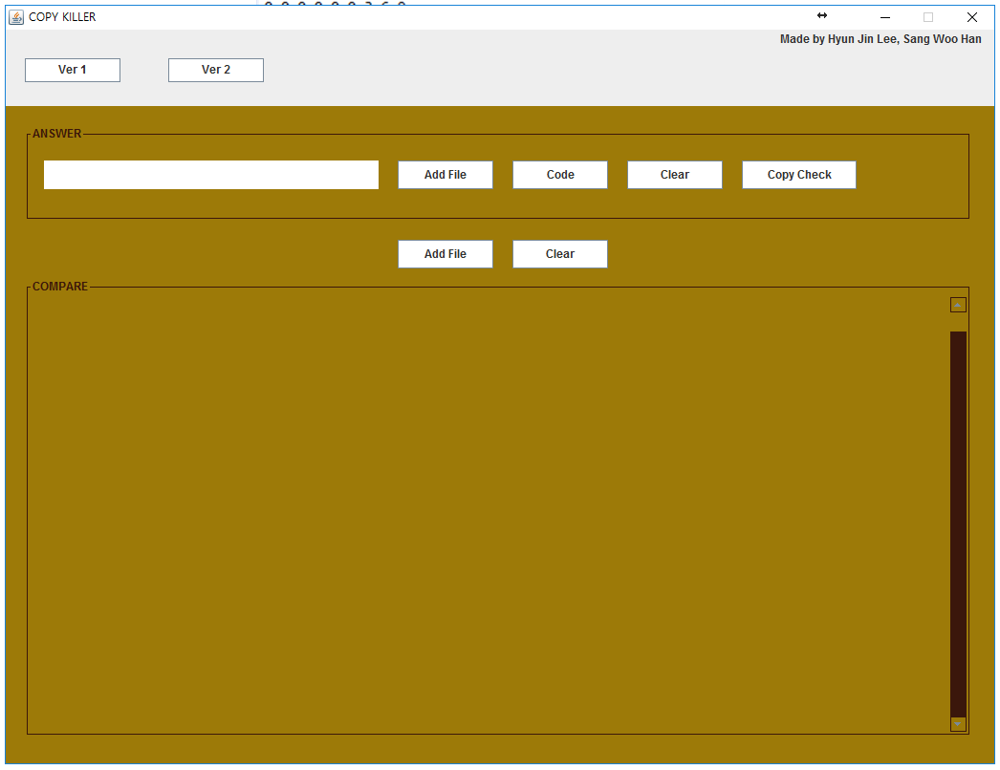

# COPY_KILLER

## Summary

This project was conducted to prevent excessive use of open source, a chronic problem with department of computer engineering.
Using the Simth-Waterman algorithm, the degree of similarity of the code is represented by a numerical value.
Performing plagiarism checks at low cost and time is the ultimate goal of this project.

In eclipse, execute program.

First, Push the "Add File" button in answer area.
And choose the answer file.

